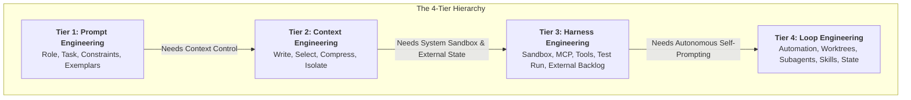
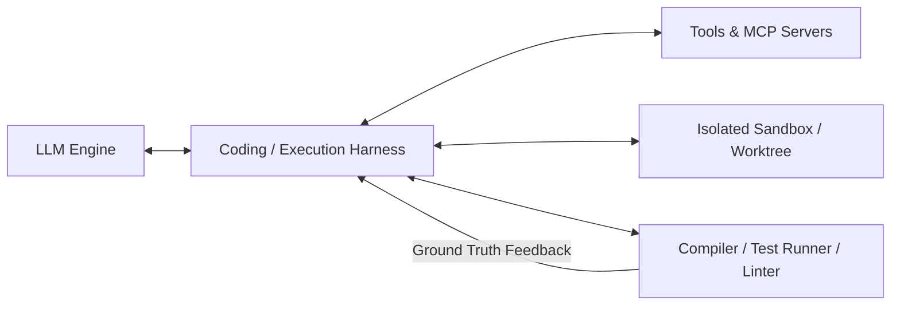
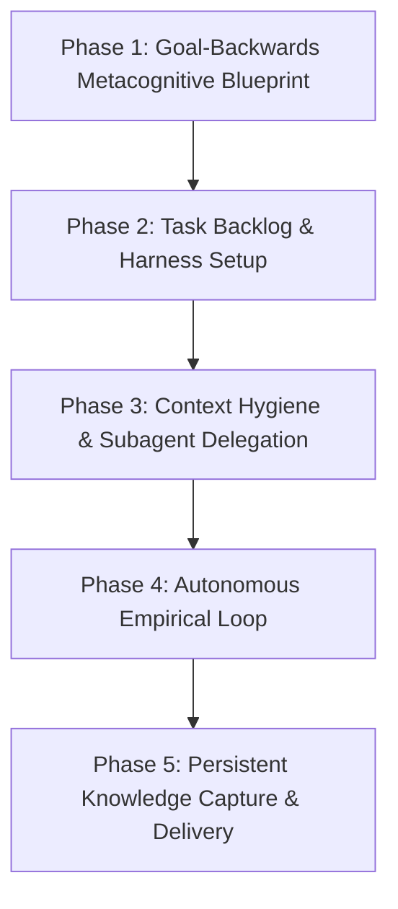

# 🧠 Metacognitive Prompting & The 4-Tier AI Engineering Stack
## *(Prompt $\rightarrow$ Context $\rightarrow$ Harness $\rightarrow$ Loop Engineering)*

> 💡 *"Prompting is not typing. It is thinking. It is a communication protocol between human intention and machine execution. Modern AI engineering evolves from writing single instructions to designing autonomous, self-prompting, self-verifying systems."*

---

## 🎯 Executive Summary: The AI Engineering Evolution

As AI capabilities expand, human interaction with LLMs has evolved across four distinct engineering paradigms. Understanding these four tiers—and how metacognition binds them together—allows you to achieve complex project goals with **minimal human prompting**.



### The 4-Tier Engineering Matrix

| Tier | Primary Focus | Key Mechanism | System Scope | Human Role |
| :--- | :--- | :--- | :--- | :--- |
| **1. Prompt Engineering** | Micro-Level Instructions | Roles, Few-Shot, System Rules | Single-turn / Short conversation | Command typist |
| **2. Context Engineering** | Context Window Hygiene | Write, Select, Compress, Isolate | Multi-turn tool execution window | Context monitor |
| **3. Harness Engineering** | Environment & Sandbox Rails | Tool Runtimes, MCP, Lints, External Backlog | System environment & filesystems | Workflow architect |
| **4. Loop Engineering** | Autonomous Self-Prompting | Self-guided loops, Worktrees, Subagents, Skills | Recurring, autonomous system | Strategic overseer |

---

## 🏗️ Section I: Metacognition & First Principles in Prompting

### 1. What is Metacognition in Prompting?
**Metacognition** is *"thinking about thinking."* In AI prompt design, metacognition means stepping back from task execution to architect the **information flow, mental model, and decision pathways** that the AI will follow.

Rather than treating the model like a **Vending Machine** (Input prompt $\rightarrow$ Output text), metacognitive prompting treats the model as a **Co-Architect**, leveraging **Backward Design**:
1. Define the desired **Target Outcome State**.
2. Reverse-engineer the **prerequisite context, missing data, and structural constraints**.
3. Instruct the AI to construct its own execution plan and task backlog.

---

### 2. First Principles & The 6 Irreducible Prompt Atoms

First principles thinking requires stripping a problem down to its fundamental truths. Before writing any master prompt, you must define the **6 Irreducible Prompt Atoms**:

```
                  ┌─────────────────────────────────────────┐
                  │          THE 6 PROMPT ATOMS             │
                  └────────────────────┬────────────────────┘
                                       │
         ┌──────────────────┬──────────┴──────────┬──────────────────┐
         ▼                  ▼                     ▼                  ▼
  ┌──────────────┐   ┌──────────────┐      ┌──────────────┐   ┌──────────────┐
  │  Goal State  │   │Source Context│      │ Constraints  │   │Process Steps │
  └──────────────┘   └──────────────┘      └──────────────┘   └──────────────┘
         │                  │                     │                  │
         └──────────────────┴──────────┬──────────┴──────────────────┘
                                       ▼
                       ┌──────────────────────────────┐
                       │  Validation & Iteration Plan │
                       └──────────────────────────────┘
```

1. **🎯 Goal State (Transformation Target)**: The exact state change required (e.g., *"Transform raw API logs into an automated anomaly detection dashboard"*).
2. **📥 Source Material & Context**: Ground truth documents, database schemas, codebase paths, or style guides.
3. **⛔ Constraints & Non-Negotiables**: Hard limits on token usage, execution time, formatting, dependencies, and taboo logic.
4. **⚙️ Process Instructions & Scaffolding**: Step-by-step reasoning steps, domain rubrics, or analogies.
5. **📊 Validation Signals (Quality Benchmark)**: Concrete pass/fail criteria, test suites, lints, or exemplars (*Few-Shot Learning*).
6. **🔄 Iteration Protocol**: Rules for how the model self-corrects upon encountering errors or failing assertions.

> [!IMPORTANT]
> Omitting any of these 6 atoms forces the model to fall back on generic default assumptions, leading to context rot and low-signal outputs.

---

## 🔬 Section II: The 4-Tier AI Engineering Hierarchy

---

### 🔹 Tier 1: Prompt Engineering (Instruction Crafting)

Prompt engineering focuses on phrasing, role definition, formatting, and structural constraints inside a single prompt payload.

#### Core Components:
* **System Role & Persona**: Setting domain expertise (*"You are a Principal Software Architect"*).
* **Few-Shot Exemplars**: Providing input-output pairs to anchor formatting and tone.
* **Negative Constraints**: Specifying explicit prohibitions (*"Do not use external libraries outside the standard library"*).
* **Output Formatting**: Enforcing structured formats (JSON, Markdown, YAML schemas).

#### Limitation:
Prompt engineering is stateless. When tasks exceed 5-10 turns, static prompt instructions become diluted by accumulating conversation history, leading to **context rot**.

---

### 🔹 Tier 2: Context Engineering (Context Window Management)

Context engineering is the discipline of designing the entire dynamic information system around the model—controlling what tokens enter, stay, and get pruned from the context window at every step of an agentic workflow.

```
       ┌─────────────────────────────────────────────────────────────┐
       │                THE CONTEXT WINDOW (FINITE CAPACITY)          │
       ├─────────────────────────────────────────────────────────────┤
       │  [System Prompt & Rules] ────> PINNED (Never Pruned)         │
       │  [Goal State & Backlog]  ────> PINNED (Never Pruned)         │
       ├─────────────────────────────────────────────────────────────┤
       │  [Transient Tool Outputs] ──> PRUNED / COMPACTED PERIODICALLY│
       │  [Raw Bash / File Dumps] ──> SUMMARIZED TO ARTIFACTS         │
       └─────────────────────────────────────────────────────────────┘
```

#### The 4 Core Context Engineering Strategies:

1. **💾 Write (Persistence)**:
   - Persisting critical state outside the active context window into markdown files, scratchpads, or database logs (e.g., `CLAUDE.md`, `RESEARCH_NOTES.md`, `tasks.json`).
   - Prevents catastrophic forgetting when the context window is reset or compacted.

2. **🔍 Select (Just-In-Time Retrieval)**:
   - Dynamically retrieving only the information relevant to the current step, rather than dumping entire codebases or databases into context.
   - Utilizes indexing, vector search (RAG), or selective file reading.

3. **🧹 Compress (Summarization & Pruning)**:
   - Truncating or summarizing old, high-token tool outputs (e.g., raw search results or long compiler logs) once the agent has extracted the core finding.
   - Maintaining context utility while reducing token bloat.

4. **🛡️ Isolate (Context Boundary Separation)**:
   - Spawning isolated subagents with clean context windows for distinct phases (e.g., Research Subagent $\rightarrow$ Writes Artifact $\rightarrow$ Reset Context $\rightarrow$ Implementation Subagent).
   - Eliminates context contamination where noisy research logs pollute code generation phases.

---

### 🔹 Tier 3: Harness Engineering (Runtime Sandbox & System Rails)

Harness engineering builds the external environment, control architecture, and safety scaffolding that wraps the LLM runtime. While context engineering manages what the model *sees*, harness engineering manages what the model *can do and measure*.



#### Key Capabilities of Harness Engineering:
* **Tool Runtimes & MCP (Model Context Protocol)**: Providing standardized interfaces for file editing, shell commands, database queries, and web browsers.
* **Empirical Feedback Loops**: Intercepting model outputs and running them through real compilers, unit tests, and linters. Ground truth errors are fed back into the model automatically.
* **External Backlog Management**: Keeping project state, task lists (`tasks.json`), and progress trackers outside the context window so task status never degrades.
* **Execution Sandboxing**: Restricting shell access, protecting sensitive environment variables, and preventing catastrophic file overwrites.

---

### 🔹 Tier 4: Loop Engineering (Autonomous Self-Prompting Systems)

Loop engineering wraps an autonomous control loop around the harness layer. It removes the human from the micro-prompting loop by enabling the agent to **prompt itself, evaluate its own progress, delegate to subagents, and recurse until the end goal is achieved**.

```
    ┌──────────────────────────────────────────────────────────────┐
    │                     THE AUTONOMOUS LOOP                      │
    │                                                              │
    │   1. Read Task Backlog (External State)                      │
    │   2. Self-Prompt Next Task Objective                         │
    │   3. Isolated Worktree Execution (Harness)                   │
    │   4. Run Empirical Tests & Linters                           │
    │   5. Subagent Verification & Review                          │
    │   6. Update Memory & Task Backlog                            │
    │   7. Loop to Next Task until Backlog Empty                    │
    └──────────────────────────────────────────────────────────────┘
```

#### Addi Osmani's 6 Pillars of Loop Engineering:

1. **🤖 Automation**: Scheduled tasks, cron triggers, or event-driven execution loops (e.g., automated hourly bug-fix checks or deployment monitoring).
2. **🌿 Worktrees (Workspace Isolation)**: Utilizing Git worktrees or temporary directories to run parallel sub-tasks without corrupting the main codebase state.
3. **🧠 Skills & Knowledge Persistence**: Maintaining domain-specific workflow rules (e.g., `SKILL.md` files) that agents load on demand to execute specialized tasks.
4. **🔌 Plugins & Connectors (MCP)**: Connecting the loop to external services, APIs, databases, and communication channels.
5. **👥 Subagents & Swarms**: Delegating specific tasks (e.g., code reviewer, security auditor, tester) to dedicated subagents with clean context windows.
6. **💾 State & Memory Management**: Maintaining cross-session memory, persistent task backlogs, and structural state logs.

---

## ⚡ Section III: The Unified Metacognitive Minimal-Prompting Method

To achieve complex project outcomes with the **least amount of human prompting**, we combine all four tiers into a single, goal-backwards execution framework: **The One-Prompt Autonomous Harness Protocol**.

### The 5-Phase Execution Protocol



#### Phase 1: Goal-Backwards Metacognitive Blueprinting (Human Prompt 1)
* The human provides a single comprehensive **Goal-Backwards Master Prompt** defining the final target state, key constraints, and validation criteria.
* The AI is instructed *not* to start coding immediately, but to reverse-engineer the project requirement, audit missing context, and draft a formal execution plan.

#### Phase 2: Harness & Task Backlog Setup
* The agent writes a persistent external backlog file (`tasks.json` or `TODO.md`) outside its active context.
* It sets up empirical validation gates (e.g., unit test templates, build scripts, lint rules).

#### Phase 3: Context Hygiene & Subagent Delegation
* The agent delegates sub-tasks (e.g., research, schema design) to clean subagents.
* High-volume research logs are compressed into markdown artifacts, resetting the main context window.

#### Phase 4: Autonomous Empirical Loop (Zero Human Interventions)
* The agent iterates through `tasks.json` inside isolated worktrees.
* Each task must pass ground-truth empirical checks (tests/compilers) before being marked complete.
* If a test fails, the error log triggers an internal self-correction loop without bothering the human.

#### Phase 5: Persistent Knowledge Capture & Final Delivery
* Upon clearing all backlog tasks, the agent saves reusable workflows as a new `SKILL.md` or memory document.
* The final deliverable is presented alongside empirical proof of success (passing test suite logs).

---

## 📋 Section IV: Universal Master Metaprompt Template

Copy and paste this template into your AI environment to initiate the **Minimal-Prompting Metacognitive Protocol** for any major project:

```markdown
# METAPROMPT: UNIFIED GOAL-BACKWARDS AUTONOMOUS ENGINE

Role: Principal AI Systems Architect & Lead Software Engineer

Goal State:
I want to achieve the following complete project outcome:
<TARGET_PROJECT_GOAL>
[Insert detailed description of the final system, feature, or deliverable you want built]
</TARGET_PROJECT_GOAL>

Project Constraints & Non-Negotiables:
- Tech Stack / Standards: [Insert languages, frameworks, or performance constraints]
- Code Quality: Clean, modular, fully typed, documented, and covered by unit tests.
- Human Interventions: MINIMAL. Operate autonomously using loop & harness engineering.

EXECUTION PROTOCOL (Follow these steps sequentially):

PHASE 1: METACOGNITIVE AUDIT & ROADMAP REVERSE-ENGINEERING
1. Analyze the Target Project Goal from First Principles.
2. Identify any missing assumptions, ambiguous schemas, or prerequisite context.
3. Generate a structured backlog file named `tasks.json` with granular, single-responsibility tasks.
4. Define the empirical pass/fail validation criteria for each task (e.g., build scripts, test suites, linter output).

PHASE 2: CONTEXT & HARNESS SETUP
1. Establish a clean workspace. Persist core project rules into a `PROJECT_RULES.md` file.
2. Initialize testing harness files before writing application code (Test-Driven Development).

PHASE 3: AUTONOMOUS LOOP EXECUTION
Iterate through `tasks.json` using the following execution loop:
  a. Load the next pending task.
  b. Execute implementation within an isolated context or worktree.
  c. Run empirical validation commands (tests, builds, lints).
  d. IF tests fail: Self-diagnose log tracebacks and refactor code until green.
  e. IF tests pass: Mark task as COMPLETE in `tasks.json`, compress context, and proceed.

PHASE 4: FINAL DELIVERABLE & KNOWLEDGE CAPTURE
1. Run full project test suite and build verification.
2. Document architectural decisions in `ARCHITECTURE.md`.
3. Present final summary with clickable file references and test proof logs.

Begin Phase 1 immediately by auditing the goal and outputting `tasks.json` and `PROJECT_RULES.md`.
```

---

## 📊 Summary Comparison: Evolution of AI Engineering

| Feature | Tier 1: Prompt Eng. | Tier 2: Context Eng. | Tier 3: Harness Eng. | Tier 4: Loop Eng. |
| :--- | :--- | :--- | :--- | :--- |
| **Primary Artifact** | String Prompt | Context Window State | Sandbox / MCP / Test Harness | Autonomous Self-Prompting Loop |
| **Context Management** | None (Single turn) | Write, Select, Compress, Isolate | External Backlog (`tasks.json`) | Cross-Session Memory & State |
| **Verification** | Human eyeball inspection | Manual output check | Automated Compilers & Test Suites | Subagent Audits & Self-Verification |
| **Human Prompts Required** | High (50+ micro-prompts) | Moderate (10-15 prompts) | Low (3-5 milestone prompts) | **Minimal (1 Master Metaprompt)** |
| **Scalability Horizon** | Minutes | 1-2 Hours | Complex Software Features | Full Autonomous Projects & Operations |

---

## 📚 References & Video Sources
- **Prompt Engineering**: [Prompt Engineering Masterclass (YouTube)](https://www.youtube.com/watch?v=2BpCk4d2Cc0)
- **Context Engineering**: [Context Engineering for AI Agents (YouTube)](https://www.youtube.com/watch?v=-h9VVJIqtvA)
- **Harness Engineering**: [Engineering Coding Harnesses (YouTube)](https://www.youtube.com/watch?v=KijChx7q2nY)
- **Loop Engineering**: [Loop Engineering Explained (YouTube)](https://www.youtube.com/watch?v=4biXYSNkn9Y)
- **Related Vault Notes**:
  - [[Prompting]]
  - [[Data Wrangling]]
  - [[Python_for_Data_Science_Roadmap]]
  - [[mathematical-ai-roadmap]]
