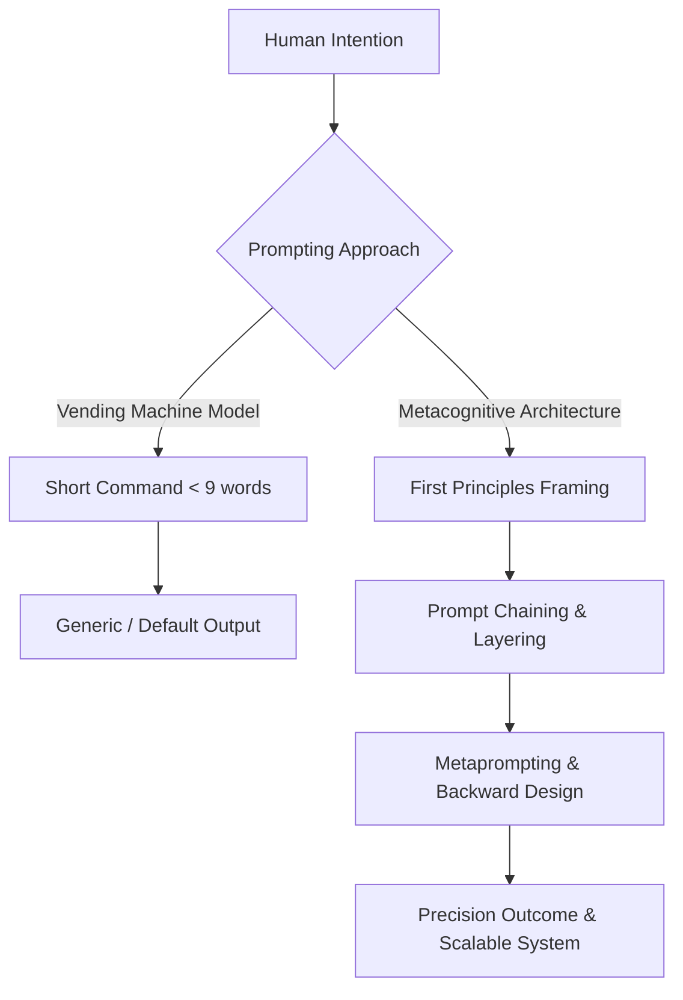
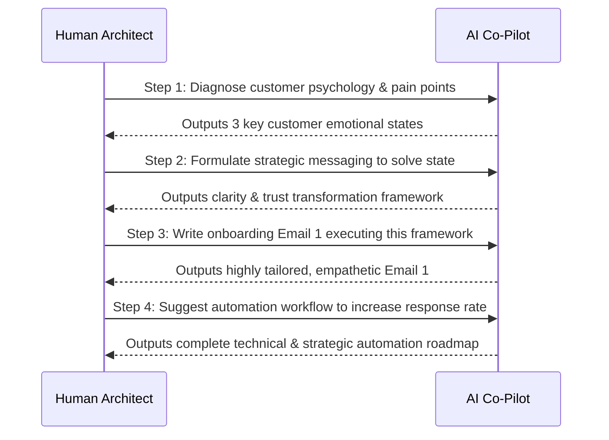

# 🧠 Metacognitive Prompting & Prompt Engineering Architecture

> 💡 *"Prompting is not typing. It is thinking. It is a communication protocol between human intention and machine execution. AI does not reward what you ask; it rewards how you think."*

---

## 🎯 Executive Summary & Philosophy

Most individuals approach Large Language Models (LLMs) like search engines: they type short requests (averaging fewer than 9 words), ask for immediate answers, scroll through generic outputs, and attribute poor results to model limitations. 

Modern AI prompt engineering requires shifting from a **Vending Machine Model** (input token $\rightarrow$ output answer) to a **Metacognitive Architecture Model** (co-designing thinking frameworks, context, and sequential roadmaps).



### Core Shift: Typing vs. Thinking

| Dimension | Search / Default Prompting | Metacognitive Prompting |
| :--- | :--- | :--- |
| **Mindset** | Asking for raw answers / shortcuts | Designing a result in your head and architecting context |
| **Interaction** | Single-turn, overloaded command | Multi-turn cognitive scaffolding & prompt chaining |
| **AI Role** | Answer vending machine | Thinking partner, co-strategist, and execution engine |
| **Leverage Point** | Doing more queries | Defining outcomes with extreme clarity |
| **Failure Mode** | Vague context $\rightarrow$ Generic outputs | Missing validation criteria $\rightarrow$ Hallucinated defaults |

---

## 🏗️ 1. First Principles Thinking in Prompting (The Grammar)

First principles thinking—championed from Aristotle to Charlie Munger and Elon Musk—involves breaking complex problems down to their irreducible components (truths free of assumption) and rebuilding from the ground up.

In prompt engineering, **First Principles is the grammar**. Where untrained users copy-paste generic internet templates, first-principles prompt architects construct custom prompts by defining the fundamental **atoms** of the task before writing a single instruction.

```
                  ┌─────────────────────────────────────────┐
                  │          THE 6 PROMPT ATOMS             │
                  └────────────────────┬────────────────────┘
                                       │
         ┌──────────────────┬──────────┴──────────┬──────────────────┐
         ▼                  ▼                     ▼                  ▼
  ┌──────────────┐   ┌──────────────┐      ┌──────────────┐   ┌──────────────┐
  │  Goal State  │   │Source Context│      │ Constraints  │   │Process Steps │
  └──────────────┘   └──────────────┘      └──────────────┘   └──────────────┘
         │                  │                     │                  │
         └──────────────────┴──────────┬──────────┴──────────────────┘
                                       ▼
                       ┌──────────────────────────────┐
                       │  Validation & Iteration Plan │
                       └──────────────────────────────┘
```

### The 6 Irreducible Atoms of a Master Prompt

> [!IMPORTANT]
> If a prompt omits any of these 6 atoms, the AI cannot optimize for what it was never instructed to care about. Missing atoms force the model to fill in the gaps with default assumptions.

1. **🎯 Goal State (Transformation Target)**
   - The precise state change required. Not just *"write a job post"*, but *"create a high-signal talent filter for a proactive accountant in an AI-first agency"*.
2. **📥 Source Material & Context**
   - The exact data, background, business environment, or voice parameters to preserve or transform.
3. **⛔ Constraints & Non-Negotiables**
   - Hard boundaries: length limits, tone requirements, taboo concepts, legal compliance, or formatting rules.
4. **⚙️ Process Instructions & Scaffolding**
   - Step-by-step reasoning paths, rubrics to follow, or analogies to utilize during generation.
5. **📊 Validation Signals (Quality Benchmark)**
   - Concrete examples (*few-shot prompting*), expected schemas, or evaluation checklists defining *"what great looks like"*.
6. **🔄 Iteration Protocol**
   - Instructions on how feedback should be incorporated, how edge cases are handled, and how corrections should be surfaced.

---

### Case Study: Naive vs. First-Principles Job Specification

```diff
- NAIVE PROMPT:
- Write a job description for an accountant in a small agency.

+ FIRST-PRINCIPLES PROMPT:
+ Write a job description for an accountant joining a fast-moving media company 
+ where AI is heavily integrated into all operations. 
+ Role Scope: Outcome ownership over financial tracking, automation oversight, and cash flow forecasting.
+ Tone: Human, direct, and appealing to proactive, detail-oriented professionals.
+ Culture: Include three unique culture differentiators reflecting a lean, intelligent team.
+ Constraints: Avoid corporate jargon, buzzwords, or passive bullet points.
```

---

## 🔗 2. Cognitive Scaffolding & Prompt Chaining (Chain of Thought)

Real intelligence is not instant recollection; it is **mental architecture**—the ability to frame, sequence, and adapt thinking under uncertainty.

Rather than squeezing complex deliverables into a single, overloaded prompt, metacognitive prompting uses **Prompt Chaining** (cognitive scaffolding). This technique layers sequential inputs, allowing each step to build context and refine clarity.



### Framing vs. Refining

* **First Principles**: Establishes the **Macro-Frame** (the boundaries, atoms, and target destination).
* **Chain of Thought / Prompt Chaining**: Executes the **Refinement Layer** (building depth iteratively through structured dialogue).

---

## 🔮 3. Metacognition & Metaprompting (Thinking About Thinking)

**Metacognition** is the practice of examining and architecting one's own thought process. In AI systems, metacognition manifests as **Metaprompting**: using AI to design, structure, and optimize the prompts and processes needed to solve complex challenges.

```
       ┌──────────────────────────────────────────────────────────────┐
       │                 TRADITIONAL PROMPTING (FORWARD)              │
       │   Human guesses prompt ──> AI attempts answer ──> Bad result │
       └──────────────────────────────────────────────────────────────┘
                                      │
                                      ▼
       ┌──────────────────────────────────────────────────────────────┐
       │              METACOGNITIVE PROMPTING (BACKWARD)              │
       │   1. Define desired Target Answer/Outcome                    │
       │   2. Ask AI: "What context & structure do you need?"         │
       │   3. Co-create optimal roadmap & system prompt               │
       │   4. Execute with 100% precision                             │
       └──────────────────────────────────────────────────────────────┘
```

### The End-Goal & Backward Design Framework

Instead of guessing how to prompt an AI for a complex objective, **provide the target end-goal / desired answer** to the AI and ask it to reverse-engineer the required inputs and roadmap.

> [!TIP]
> **The Metacognitive Protocol**:
> 1. **Specify the Target Answer/Outcome**: Clearly state what final output or system success looks like.
> 2. **Inquire for Prerequisite Context**: Ask: *"What specific data, business context, constraints, or parameters do you need from me to achieve this exact answer?"*
> 3. **Architect the Structural Roadmap**: Ask: *"What intermediate steps, reasoning sequence, or subprocesses should we execute to guarantee this outcome?"*
> 4. **Generate the Optimal Execution Prompt**: Ask: *"Generate the optimal master prompt / prompt chain for this exact workflow."*

### Why Backward Design Produces Coherent Roadmaps

1. **Eliminates Information Deficits**: The AI explicitly highlights missing variables before generation begins.
2. **Aligns Mental Models**: Ensures the human's vision matches the machine's processing structure.
3. **Prevents Drift & Hallucination**: Establishing structural milestones anchors the AI's generation path.

---

## 🎓 4. Google's Prompt Essentials Framework

The **Google Prompt Essentials Framework** (developed by the Google DeepMind & Gemini teams) provides a universal 5-step structure for effective prompt composition across text, image, and multimodal workflows.

### The 5-Step Framework (`C-T-R-E-I`)

| Step | Component | Description |
| :---: | :--- | :--- |
| **1** | **Task** | Clear, direct action verb defining the required generation or analysis. |
| **2** | **Context** | Background information, persona/role, target audience, and environment. |
| **3** | **References** | Exemplars, benchmark datasets, or templates (*Few-Shot Learning*). |
| **4** | **Evaluate** | Assessing output quality against explicit rubrics or validation signals. |
| **5** | **Iterate** | Refining through prompt adjustments, follow-up chains, or parameter tuning. |

---

## 🛠️ 5. Practical Metacognitive Prompt Templates

### Template 1: The Backward Design & Roadmap Engine (Metaprompt)

```markdown
Role: Senior AI Systems Architect & Metacognitive Strategist

Goal: I want to achieve the following target outcome:
<TARGET_ANSWER_OR_OUTCOME>
[Insert the exact desired end result, deliverable, or solution state here]
</TARGET_ANSWER_OR_OUTCOME>

Before generating the final output, execute the following metacognitive protocol:

1. Context Audit: List 5 specific questions regarding context, constraints, data, or preferences that you need me to answer to ensure 100% precision.
2. Structural Breakdown: Outline the logical sequence of steps and intermediate milestones required to move from raw input to this final outcome.
3. Master Prompt Generation: Based on your analysis, write the optimal First-Principles master prompt that I should run to execute this task.
```

---

### Template 2: First-Principles Master Prompt Specifier

```markdown
Role: [Define Expert Role, e.g., Senior Data Scientist / Executive Copywriter]

Task: [Define Action Verb and Target Deliverable]

Goal State:
- Primary Transformation: [What raw input becomes]
- Business / Strategic Impact: [What success achieves]

Context & Source Material:
- Source Data: [Paste or reference data]
- Audience Persona: [Target recipient / user]

Constraints & Boundaries:
- Length / Format: [e.g., 500 words, markdown table, JSON schema]
- Tone & Style: [e.g., Authoritative, concise, non-academic]
- Taboo Elements: [e.g., No buzzwords, no passive voice, no assumptions]

Validation Signals & Quality Rubric:
- Output must meet the following checklist:
  [ ] Feature A is explicitly modeled
  [ ] Edge case B is handled
  [ ] Format matches reference structure

Instructions:
Execute the task step-by-step. Show your reasoning before presenting the final output.
```

---

### Template 3: Recursive Chain-of-Thought Refinement Chain

```markdown
Step 1 (Diagnosis):
"Analyze [Topic/Dataset]. Identify the top 3 core friction points or structural challenges. Do not write solutions yet."

Step 2 (Strategy Mapping):
"For each of the 3 friction points identified above, formulate 2 distinct strategic interventions based on first principles."

Step 3 (Execution Blueprint):
"Select the optimal intervention for each point and draft a step-by-step implementation blueprint. Include success metrics."

Step 4 (Metacognitive Review):
"Evaluate the blueprint against potential failure modes. What edge cases could break this system, and how do we patch them?"
```

---

## 📊 Summary Matrix: Prompting Evolution

$$\text{Leverage} = \frac{\text{Human Context Clarity} \times \text{Metacognitive Architecture}}{\text{Output Guesswork}}$$

```
Level 1: Vending Machine (Command-driven)
  │  └─ "Write an email about product launch"
  ▼
Level 2: Structured Context (Framework-driven)
  │  └─ Task + Persona + Format + Constraints
  ▼
Level 3: Cognitive Scaffolding (Chain of Thought)
  │  └─ Prompt Chaining: Step 1 (Identify) ➔ Step 2 (Formulate) ➔ Step 3 (Execute)
  ▼
Level 4: Metacognitive Architecture (Goal-Backwards Metaprompting)
     └─ "Here is the exact answer state I need. What inputs, structure, and prompt chain do you require to get us there?"
```

---

## 📚 References & Further Study
- **Video Source**: [Prompting Is Thinking (YouTube)](https://www.youtube.com/watch?v=T6iMHtEL9FU)
- **Google Professional Specialization**: *Google Prompt Essentials* (Coursera)
- **Related Vault Notes**:
  - [[Data Wrangling]]
  - [[Python_for_Data_Science_Roadmap]]
  - [[mathematical-ai-roadmap]]
